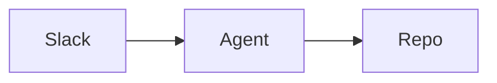

# MDX components cheatsheet

Components are available in every `.mdx` page with no imports. Use them where
they aid scanning; plain markdown is fine for most prose. Full gallery:
<https://www.mintlify.com/docs/components/index.md> (each component page:
`components/<name>.md`).

## Callouts

```mdx
<Note>Supplementary context.</Note>
<Tip>Best practice or shortcut.</Tip>
<Warning>Destructive or irreversible action ahead.</Warning>
<Info>Neutral background information.</Info>
<Check>Confirmation that something succeeded.</Check>
```

## Steps — any procedure with 2+ sequential actions

```mdx
<Steps>
  <Step title="Install the CLI">
    ```bash
    npm i -g mint
    ```
  </Step>
  <Step title="Preview locally">
    Run `mint dev` and open http://localhost:3000.
  </Step>
</Steps>
```

## Tabs / CodeGroup — parallel variants

```mdx
<Tabs>
  <Tab title="macOS">brew install foo</Tab>
  <Tab title="Linux">apt install foo</Tab>
</Tabs>
```

````mdx
<CodeGroup>
```bash npm
npm run agent
```
```bash pnpm
pnpm agent
```
</CodeGroup>
````

## Cards — landing pages and jump-off points

```mdx
<CardGroup cols={2}>
  <Card title="Quickstart" icon="rocket" href="/quickstart">
    Get running in five minutes.
  </Card>
  <Card title="Architecture" icon="sitemap" href="/concepts/architecture">
    How the pieces fit together.
  </Card>
</CardGroup>
```

## Accordions / Expandable — optional detail

```mdx
<AccordionGroup>
  <Accordion title="Troubleshooting: port already in use">
    ...
  </Accordion>
</AccordionGroup>
```

## Diagrams — mermaid fence renders natively

````mdx

````

## API-ish reference fields

```mdx
<ParamField path="idle_timeout" type="number" default="600">
  Seconds before an idle session is evicted.
</ParamField>
<ResponseField name="session_id" type="string" required>
  Identifier of the created session.
</ResponseField>
```

## Others worth knowing

- `<Frame caption="...">` — border + caption around images.
- `<Tooltip tip="...">term</Tooltip>` — hover definitions.
- `<Update label="2026-08-01" description="v0.2">` — changelog entries.
- `<Columns cols={2}>` — side-by-side layout.
- `<Icon icon="database" />` — inline icons (Lucide et al.).
- `<Tree>` — file/folder hierarchies.
- `<Visibility>` — show content only to humans or only to AI agents.
